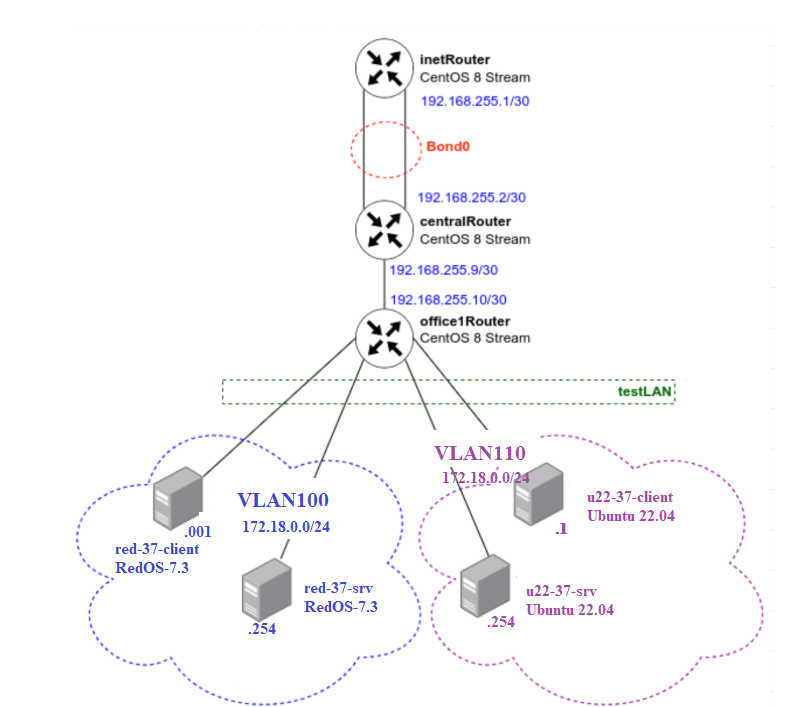
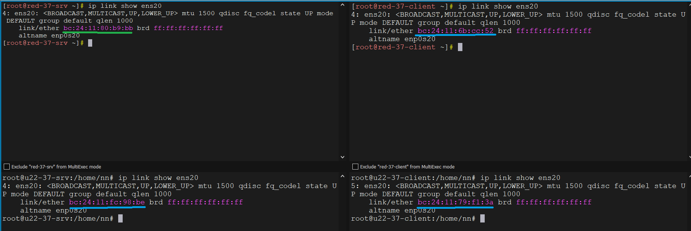
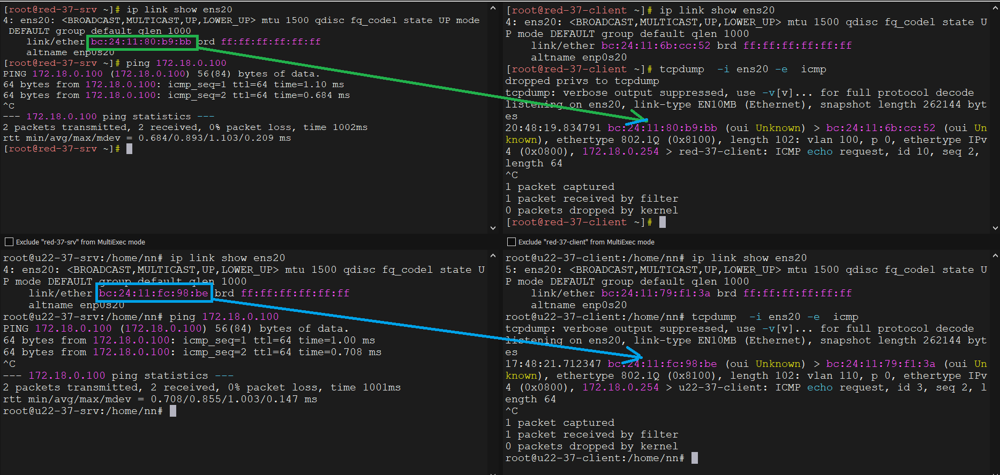
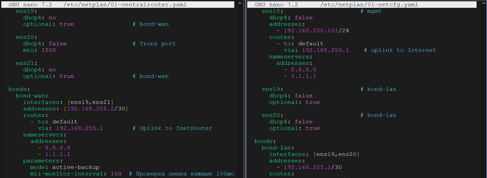
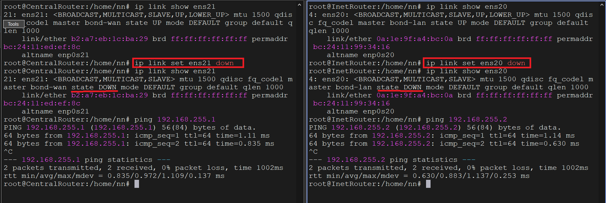

## ДЗ-37 VLAN, LACP

#### Цель домашнего задания  
+ Научиться настраивать VLAN и LACP.   

#### Описание домашнего задания  
в Office1 в тестовой подсети появляется сервера с доп интерфейсами и адресами
в internal сети testLAN: 
- red-37-client - 172.18.0.100  
- u22-37-client - 172.18.0.100  
- red-37-srv- 172.18.0.254   
- u22-37-srv- 172.18.0.254  

Равести вланами:
vlan 100 red-37-client <-> red-37-srv
vlan 110 u22-37-client <-> u22-37-srv

Между centralRouter и inetRouter "пробросить" 2 линка (общая inernal сеть) и объединить их в бонд, проверить работу c отключением интерфейсов

[def]: pics/0_net_scheme.png 
  
### 1. VLAN
На сервере red-37-srv  - создаем интерфейс vlan 100
nano /etc/sysconfig/network-scripts/ifcfg-vlan100
```
VLAN=yes
#Тип интерфейса - VLAN
TYPE=Vlan
#Указываем физическое устройство, через которые будет работать VLAN
PHYSDEV=ens20
#Указываем номер VLAN (VLAN_ID)
VLAN_ID=100
VLAN_NAME_TYPE=DEV_PLUS_VID_NO_PAD
PROXY_METHOD=none
BROWSER_ONLY=no
BOOTPROTO=none
#Указываем IP-адрес интерфейса
IPADDR=172.18.0.254
#Указываем префикс (маску) подсети
PREFIX=24
#Указываем имя vlan
NAME=vlan1
#Указываем имя подинтерфейса
DEVICE=ens20.100
ONBOOT=yes
```
На клиенте red-37-client - аналогично, только адрес будет 172.18.0.100  

На сервере u22-37-srv  
Настраиваем интерфейс VLAN110 с адресом 172.18.0.254/24
root@u22-37-srv:/home/nn# cat /etc/netplan/00-conf-net.yaml  
```  
network:
  version: 2
  ethernets:
    ens18:
      dhcp4: false
      addresses:
        - 192.168.250.126/24
      routes:
        - to: default
          via: 192.168.250.1
    ens19:
      addresses:
        - 192.168.50.65/24

    ens20:
      dhcp4: false
      accept-ra: false
      link-local: []

  vlans:
    vlan110:
      id: 110
      link: ens20
      addresses: [ "172.18.0.254/24" ]  
```  
На клиенте u22-37-client такие же настройки, только адрес 172.18.0.100/24  
<details>  
<summary>  
Описание ошибки при настройке  
</summary>
Здесь была допущена ошибка: VLAN-интерфейс сначала привязал к ens19, а не ens20, и это работало, но захотелось одинаковых настроек и перепривязал vlan к ens20. В результате связность между ubuntu-машинами пропала. 
Не помогли ни перезапуск systemctl restart systemd-networkd, ни полная перезагрузка клиента, vlan оставался привязан к ens19:  
```  
root@u22-37-client:/home/nn# ip link show 
...  
4: vlan110@ens19: <BROADCAST,MULTICAST,UP,LOWER_UP> mtu 1500 qdisc noqueue state UP mode DEFAULT group default qlen 1000
    link/ether bc:24:11:ac:8e:fc brd ff:ff:ff:ff:ff:ff
```  
В результате тегированные кадры Ethernet не отправлялись через физический интерфейс:  
```
root@u22-37-client:/home/nn# tcpdump -i ens20 -e -n vlan 110
tcpdump: verbose output suppressed, use -v[v]... for full protocol decode
listening on ens20, link-type EN10MB (Ethernet), snapshot length 262144 bytes
15:33:20.438973 bc:24:11:fc:98:be > 33:33:00:00:00:02, ethertype 802.1Q (0x8100), length 74: vlan 110, p 0, ethertype IPv6 (0x86dd), fe80::be24:11ff:fefc:98be > ff02::2: ICMP6, router solicitation, length 16
^C
1 packet captured
1 packet received by filter
0 packets dropped by kernel
```  

Вероятная причина: в Netplan при смене настроек старые виртуальные интерфейсы часто «повисают» в памяти или привязываются не к тем портам.    
Почему перезагрузка не помогала?
Netplan — это генератор конфигурации. Когда применяется netplan apply, он создает файлы настроек для systemd-networkd в директории /run/systemd/network/.
Поскольку сначала я сделал привязку к ens19, Netplan сгенерировал соответствующие .network и .netdev файлы. При изменении конфига на ens20 старый файл конфигурации в /run/systemd/network/ сохранился, и при загрузке система видела две инструкции: «создать vlan110 на ens19» и «создать vlan110 на ens20». Поскольку имя интерфейса одинаковое, выигрывал тот, кто обработался первым.

Как исправил: удалил интерфейс vlan и заново применил netplan.    
```  
root@u22-37-client:/home/nn# ip link delete vlan110
root@u22-37-client:/home/nn#
root@u22-37-client:/home/nn# ip -br addr
lo               UNKNOWN        127.0.0.1/8 ::1/128
ens18            UP             192.168.250.129/24 fe80::be24:11ff:fee7:7c09/64
ens19            UP             192.168.50.70/24 fe80::be24:11ff:feac:8efc/64
ens20            UP
root@u22-37-client:/home/nn# netplan try
Do you want to keep these settings?

Press ENTER before the timeout to accept the new configuration

Changes will revert in 118 seconds
Configuration accepted.
root@u22-37-client:/home/nn#
root@u22-37-client:/home/nn#
root@u22-37-client:/home/nn# ip -br addr
lo               UNKNOWN        127.0.0.1/8 ::1/128
ens18            UP             192.168.250.129/24 fe80::be24:11ff:fee7:7c09/64
ens19            UP             192.168.50.70/24 fe80::be24:11ff:feac:8efc/64
ens20            UP
vlan110@ens20    UP             172.18.0.100/24 fe80::be24:11ff:fe79:f13a/64
root@u22-37-client:/home/nn# ping 172.18.0.254
PING 172.18.0.254 (172.18.0.254) 56(84) bytes of data.
64 bytes from 172.18.0.254: icmp_seq=1 ttl=64 time=1.89 ms
64 bytes from 172.18.0.254: icmp_seq=2 ttl=64 time=0.601 ms
```  
Связность восстановилась.  
</details>  
MAC-адреса виртуальных машин:  
  

Пинг от серверов к клиентам: tcpdump показывает, что пинги идут в каналах соответствующих VLAN:  
  
##### Задание VLAN выполнено  
### Настройка etherchannel LACP Ubuntu-machines
InetRouter  
```
root@InetRouter:/home/nn# ip -br addr
lo               UNKNOWN        127.0.0.1/8 ::1/128
ens18            UP             192.168.250.101/24      # Uplink to Internet
ens19            UP             192.168.255.1/30        # To Central Router (bond-lan)   
ens20            DOWN                                   # New iface (for bond-lan)
```  

CentralRouter  
```  
root@CentralRouter:/home/nn#  ip -br addr
lo               UNKNOWN        127.0.0.1/8 ::1/128
ens18            UP             192.168.250.122/24 
ens19            UP             192.168.255.2/30    # Link to InetRouter (bond-wan)
ens20            UP             
vlan10@ens20     UP             192.168.0.1/28 
vlan30@ens20     UP             192.168.0.65/26 
vlan20@ens20     UP             192.168.0.33/28 
vlan200@ens20    UP             
vlan100@ens20    UP             192.168.255.9/30 
vlan2200@ens20   UP             192.168.255.5/30 
ens21            DOWN                               # New iface (for bond-wan)
root@CentralRouter:/home/nn#
```  
Настраиваем bond-wan на CentralRouter:  
```
  bonds:
    bond-wan:
      interfaces: [ens19,ens21]
      addresses: [192.168.255.2/30]
      routes:
        - to: default
          via: 192.168.255.1        # Uplink to InetRouter
      nameservers:
        addresses:
          - 8.8.8.8
          - 1.1.1.1
      parameters:
        mode: active-backup
        mii-monitor-interval: 100  # Проверка линка каждые 100мс
```
Настраиваем bond-lan на InetRouter:  
```
 ens19:                     # bond-lan
      dhcp4: false
      optional: true

    ens20:                     # bond-lan
      dhcp4: false
      optional: true

  bonds:
    bond-lan:
      interfaces: [ens19,ens20]
      addresses:
        - 192.168.255.1/30
      routes:
         - to: 192.168.0.0/16
           via: 192.168.255.2
      parameters:
        mode: active-backup
        mii-monitor-interval: 100  # Проверка линка каждые 100 ms
```
Скриншот конфигурационных файлов netplan:  
  

Проверяем пинг с отключенными интерфейсами:  


Пинг проходит, связность не потеряна.
## ДЗ-37 выполнено


